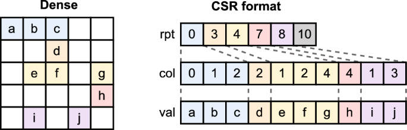

# Usage

## Script usages

`python convert_mtx.py <directory>`: 
1. This script converts all `dense.mtx` matrices in the subdirectories of supplied directory into dense matrix representation. Stored as `dense.in` at the same subdirectory where `dense.mtx` is found. 
2. This script converts all `*.mtx` that is not `dense.mtx` in the subdirectories of supplied directory into CSR, CSC, and row-major COO matrix representation. Stored as `filename.csr`, `filename.csc`, or `filename.coo` at the same subdirectory where `filename.mtx` is found.

## File formats
`*.mtx`: These are the files stored in matrix market format. See [Matrix Market](https://math.nist.gov/MatrixMarket/formats.html).

`dense.in`: These are matrices stored in dense matrix format. The files are stored in the formar below:
```
rows cols num-non-zeros
val(0,0) val(0,1) ...
val(1,0) val(1,1) ...
...
```

EXAMPLE:
```
10 10 76                # there are 10 rows, 10 cols, and 76 non-zero elements in this matrix
1 0 3 0 5 0 7 0 9 0    # values for row 0
0 2 0 4 0 6 0 8 0 10    # values for row 1
...
```

`*.csr`: These are files stored in CSR matrix format. The files are stored in the format below
```
rows cols num-non-zeros
row_ptr: indicate where each row starts and ends in values. Size = row + 1
col_idx: stores column indices of non-zero elements. Size = num-non-zeros 
values: stores non-zero elemenet values. Size = num-non-zeros 
```

EXAMPLE:
```
5 5 10          # 5 rows, 5 columns, 10 non-zero elements
0 3 4 7 8 10    # stores the row pointer
0 1 2 2 1 2 4 4 1 3
a b c d e f g h i j     # Our data will all be numbers this is just an example
```



`*.csc`: These are files stored in CSC matrix format similar to CSR format. The files are stored in the format below. See example of CSR to understand how this format is stored.
```
rows cols num-non-zeros
col_ptr: indicate where each col starts and ends in values. Size = col + 1
row_idx: stores row indices of non-zero elements. Size = num-non-zeros 
values: stores non-zero elemenet values. Size = num-non-zeros 
```

`*.coo`: These are files stored in COO matrix format. The files are stored in the format below
```
rows cols num-non-zeros
row_idx0 col_idx0 value0
row_idx1 col_idx1 value1
...
```

EXAMPLE: In the above example
```
5 5 10
0 0 a
0 1 b
0 2 c
1 2 d
...
```